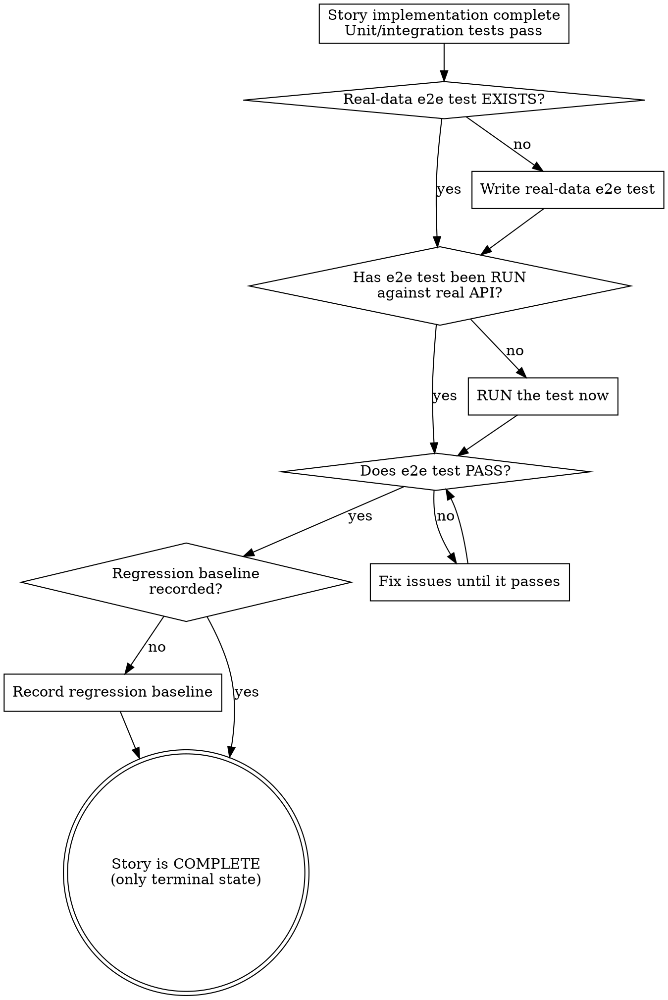

# Writing Real-Data E2E Tests

## Overview

An e2e test calls the **real** CLI against the **real** external API and asserts **real** data landed in the **real** database. No mocks. If the external service is down, the test fails — that's information, not noise.

**Violating the letter of these rules is violating the spirit.** Mocking "just for stability" is still mocking. Writing without running is still skipping.

## When to Use

- A user story is implemented, unit/integration tests pass, and the story needs final verification
- The project has a CLI entrypoint that calls an external API
- BEFORE marking a story as done

**When NOT to use:** Writing unit tests (use superpowers:test-driven-development). Testing browser UIs (use Playwright skills). Projects with no external service dependency.

## End-of-Story Flow



If any step is skipped, the story is **not done**.

## The Rules

**1. Call the REAL external service. No mocks. No stubs. No recorded responses.**

Any mock makes it an integration test, not an e2e test. The defining property of e2e is that real data flows through the real system.

**No exceptions:**
- Not for "stability"
- Not for "speed"
- Not for "the API might be down"
- Not for "it's flaky"

**2. Call through the REAL CLI entrypoint via `subprocess.run`.**

Import internal Python functions = integration test. Calling `leaflets discover-lidl` as a real OS process = e2e test.

**3. Assert REAL data, not just return codes.**

Assert that real records exist in the real database with real content — IDs, names, URLs — not just `returncode == 0` or `count > 0`. A command can succeed with zero data.

**4. RUN the test. Don't just write it.**

A test file on disk that has never been executed is documentation, not a test. The test must pass against the real API before the story is complete.

**No exceptions:**
- Not "I'll run it later"
- Not "the code looks correct"
- Not "unit tests prove it works"

**5. Gate with `@pytest.mark.e2e`. Run on-demand with `pytest --run-e2e`.**

Real external services are rate-limited and change. Don't run e2e in every CI commit. But DO run it at end of story.

**6. Record a regression baseline.**

After the first green run, snapshot the extracted output as JSON. Future runs compare against it — differences are either real regressions or real external changes, and you must investigate either way.

**7. No browser tools. `subprocess.run` is the harness.**

This is a CLI tool. Don't reach for Playwright, Selenium, or any browser automation. The e2e harness is `subprocess.run` + `sqlite3` + `pytest`.

## Rationalization Table

| Excuse | Reality |
|--------|---------|
| "Unit tests with TDD already cover this" | Unit tests verify implementation. E2E verifies the wired-up system against the real service. Different things. |
| "The external API might be down that day" | That IS the test. If the API is down, e2e should fail. Don't mock to hide real failures. |
| "Browser/Playwright is the e2e standard" | For web apps. This is a CLI. `subprocess.run` is the harness. |
| "Mock the external service for stability" | Mocking = integration test. The whole point of e2e is real data from the real service. |
| "I wrote the test, story is done" | Writing ≠ running. The test must be EXECUTED against the real API and pass. |
| "Flaky tests aren't worth maintaining" | Flakiness means the external service is unreliable. That's information. A failing e2e test means your integration IS broken. |
| "I'll just run the CLI manually" | Manual runs aren't reproducible, aren't gated, and don't create regression baselines. |
| "Regression is just re-running tests" | For unit/integration, yes. For e2e you also need a recorded baseline to detect real external changes. |
| "This is different because the API is rate-limited" | Rate limiting is a real constraint. The `@pytest.mark.e2e` marker lets you run on-demand. The answer is gating, not mocking. |
| "I don't need pytest, I already ran the CLI" | A one-off manual run validates today. A gated pytest test validates forever and creates a regression baseline. |

## Quick Reference

| Step | What | Gate |
|------|------|------|
| Configure pytest | `[tool.pytest.ini_options]` with `markers = ["e2e: ..."]` | Once per project |
| Skip e2e by default | `conftest.py`: skip `@pytest.mark.e2e` unless `--run-e2e` | Once per project |
| Write the test | `tests/e2e/test_<command>_real.py` with `@pytest.mark.e2e` | Per story |
| Run the test | `pytest tests/e2e/ --run-e2e` | End of story |
| Record baseline | Snapshot to `tests/e2e/baselines/<command>.json` | First green run |
| Verify regression | Compare next run against baseline | Every e2e run |

## Implementation

```python
# tests/e2e/test_discover_lidl_real.py
"""End-of-story e2e: verify discover-lidl against the live Lidl API."""
import json, sqlite3, subprocess, sys
from pathlib import Path
import pytest

@pytest.mark.e2e
def test_discover_lidl_real_data(tmp_path, monkeypatch):
    """REAL Lidl API → REAL leaflets → REAL SQLite. No mocks."""
    db_path = tmp_path / "leaflets.db"
    monkeypatch.setenv("LEAFLETS_DATABASE_PATH", str(db_path))

    # Call the REAL CLI as a REAL subprocess
    result = subprocess.run(
        [sys.executable, "-m", "leaflet_automation.cli.main", "discover-lidl"],
        capture_output=True, text=True, timeout=120,
    )
    assert result.returncode == 0, f"CLI failed: {result.stderr}"

    # Assert REAL data in REAL database
    conn = sqlite3.connect(str(db_path))
    rows = conn.execute("SELECT id, name, url FROM leaflets").fetchall()
    conn.close()
    assert len(rows) > 0, "No leaflets discovered from live API"
    for leaflet_id, name, url in rows:
        assert leaflet_id, "Leaflet ID empty"
        assert name, "Leaflet name empty"
        assert url.startswith("https://"), f"Bad URL: {url}"

    # Record regression baseline (first run only)
    baseline = Path("tests/e2e/baselines/discover_lidl.json")
    baseline.parent.mkdir(parents=True, exist_ok=True)
    if not baseline.exists():
        baseline.write_text(json.dumps(
            [{"id": r[0], "name": r[1], "url": r[2]} for r in rows],
            indent=2, ensure_ascii=False,
        ))
```

```ini
# pyproject.toml — add markers
# [tool.pytest.ini_options]
# markers = ["e2e: real external API — run on-demand, not in every CI"]
# testpaths = ["tests"]
```

```python
# tests/conftest.py — gate e2e behind --run-e2e flag
import pytest
def pytest_addoption(parser):
    parser.addoption("--run-e2e", action="store_true", default=False,
                     help="Run real-data e2e tests")
def pytest_collection_modifyitems(config, items):
    if not config.getoption("--run-e2e"):
        skip = pytest.mark.skip(reason="Needs --run-e2e for real-data tests")
        for item in items:
            if "e2e" in item.keywords:
                item.add_marker(skip)
```

**Run:** `pytest tests/e2e/ --run-e2e`

## Common Mistakes

- **Calling internal Python functions instead of the CLI subprocess** — that's an integration test, not e2e
- **Asserting only `returncode == 0`** — the command can succeed with zero data
- **Running the test in every CI commit** — rate-limit the real API; gate with `--run-e2e`
- **Not recording a baseline** — without it you can't detect real external changes
- **Reaching for Playwright** — this is a CLI, not a browser

## Red Flags — STOP

- Reaching for Playwright, Selenium, or browser tools on a CLI project
- Proposing to mock, stub, or record the external service
- Writing the test but not running it
- Marking the story done without a green e2e run
- Treating flakiness as an excuse to mock instead of as real information
- Saying "unit tests cover e2e"
- Suggesting `subprocess.run` with no real assertions on real data

**All of these mean: Stop. Write a real-data e2e test. Run it. Then the story is done.**